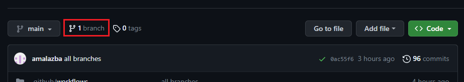
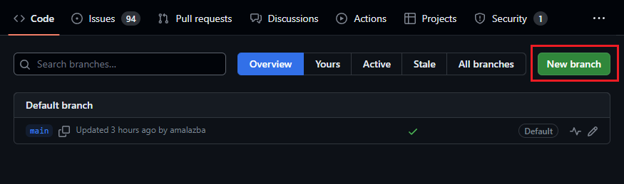
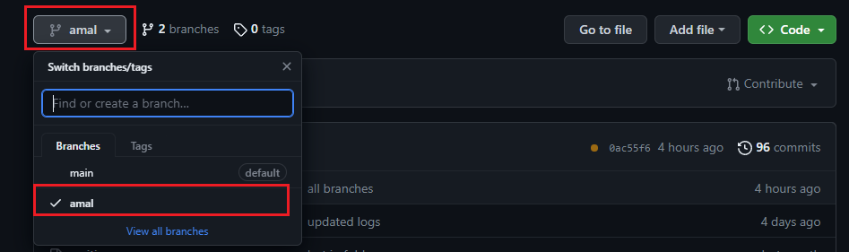
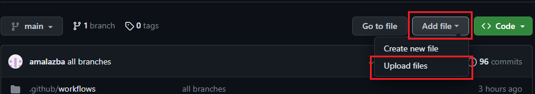
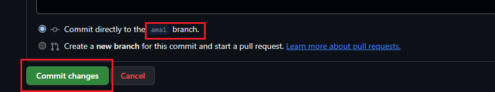

# Smellybot evaluation

### Step1: Use the bot
1. Login to the evaluation account (the username and password will be given to you)
2. Creat a new branch by your name or neckname
    1. Click on branches
    

    2. Create new branch (use your name or nickname)
    

### Step2: Add a project to the fork/branch repository 
- A. Add your Java project or download a sample project from [here](https://github.com/amalazba/src-test)
    1. Make sure you select the branch you created 
    

    2. Click Add file >> Upload files
    

    3. Commit the changes to your branch
    

### Step3: View reports and issues
1. Go to Actions tap and view the status of the workflow, wait until it is finished
2. Go to Issues tap and view created issues
3. Click on the links, you will see two files
    1. The first file is the class-level code smells detected in the project where isDC refers to a class that suffer from Data Class smell, and isGC refers to a class that suffer from God Class smell
    2. The second file is the method-level code smells detected in the project where isFE refers to a method that suffer from Feature Envy smell, and isFE refers to a method that suffer from Long Method smell
4. Go to Code tap and check any new files

# How to install the bot
1. Fork the [Smellybot](https://github.com/amalazba/smellybot) repository to your account
2. Install the Github app named Smelly-Bot into the forked repository (ONLY) from [here](https://github.com/apps/smelly-bot)
3. Add two Actions secrets APP_ID and APP_PRIVATE_KEY, use the values in secrets.txt file: repo Settings >> Secrets and variables >> actions >> New repository secret
4. Make sure the Issues tap is available, to enable: repo Settings >> General >> Features >> issues
5. Enable GitHub Actions: Go to Actions tap >> click on "I understand my workflows, go ahead and enable them"